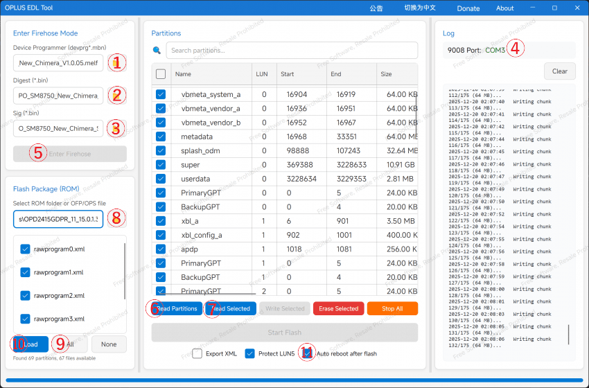
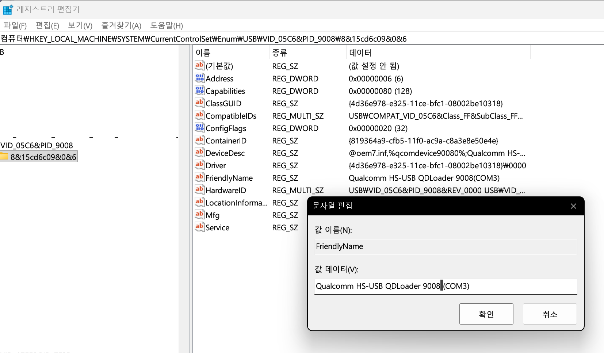

# 벽돌 해결 / 교차 플래싱 가이드 (EDL 방식)

⚠️ **필독** 이 방법은 OxygenOS 16.0.3.500부터 안티 롤백(Anti-Rollback, ARB)이 도입되어 사용이 불가능합니다. ColorOS 16.0.3.501 버전에서는 아직 ARB가 도입되지 않아 사용이 가능합니다.

이 가이드는 EDL(Emergency Download) 모드를 사용하여 기기를 벽돌 상태에서 복구하거나 OnePlus Pad 2 Pro와 OnePlus Pad 3 간의 변환(교차 플래싱)을 하는 방법을 설명합니다.

---

## **준비물**
* **OplusEdlTool:** 최신 버전을 [여기](https://static-tcdn.anteasy.com/xasdun/upload-log/oet-upload.html)에서 다운로드하세요.
* **Firehose 파일:** `oppo_oneplus_realme_Files.rar`를 [여기](https://xdaforums.com/t/oppo-oneplus-realme-qualcomm-files-share.4769736/)에서 다운로드하세요.
* **EDL 패키지:** 플래싱하려는 대상 펌웨어입니다.
    * [OnePlus Pad 3 (OPD2415)](https://dfs-serverauto-in.allawnofs.com/dfs/25/05/12/ec3fb9a938c3462abe962c37a179d92b.zip)
    * [OnePlus Pad 2 Pro (OPD2413)](https://dfs-serverauto-in.allawnofs.com/dfs/25/08/05/5c568cdb9436442796dac8f2d0eae4ac.zip)
* **ocdt.img (선택):** Pad 2 Pro와 Pad 3 간 변환 시 스타일러스 등의 호환성 문제를 해결하기 위해 필요합니다. [여기](https://drive.google.com/file/d/1SR0xg_MQtoSDGPM2XUGgo9vw3TpaVwUo/view?usp=sharing)에서 다운로드하세요.

---

## **사용법**

### **1. 툴 설정**
`OplusEdlTool`과 `oppo_oneplus_realme_Files.rar`의 압축을 풉니다.
압축 푼 폴더에서 `OplusEdlTool.exe`를 실행합니다.

**툴에서 파일 경로 설정:**
* **Device Programmer:** `oppo_oneplus_realme_Files\SM8750_8E` 폴더에 있는 `OPPO_SM8750_V1.0.05.melf`를 선택합니다.
* **Digest:** `OPPO_SM8750_Digest.elf`를 선택합니다.
* **Sig:** `OPPO_SM8750_Sign.bin`을 선택합니다.

### **2. EDL 모드 진입**
기기를 EDL 모드로 재부팅합니다.
* 기기가 하드 브릭(부트 로고도 안 뜨는 상태)된 경우, "Hydra Pro v2 EDL 케이블" 같은 특수 케이블이 필요할 수 있습니다.

### **3. 포트 감지 및 레지스트리 수정**
윈도우에서 **장치 관리자**를 열고 `Qualcomm HS-USB QDLoader 9008 (COM)`이 있는지 확인합니다.

> **⚠️ 중요한 버그 수정**
> 이 툴에는 `9008`과 괄호 `(COM)` 사이에 공백이 없으면 포트를 감지하지 못하는 버그가 있습니다.
> * **문제:** `Qualcomm HS-USB QDLoader 9008(COM3)`
> * **정상:** `Qualcomm HS-USB QDLoader 9008 (COM3)`

**수정 방법:**
1.  레지스트리 편집기를 엽니다 (`Win + R`, `regedit` 입력).
2.  다음 경로로 이동합니다: `Computer\HKEY_LOCAL_MACHINE\SYSTEM\CurrentControlSet\Enum\USB\VID_05C6&PID_9008`.
3.  하위 폴더로 들어가 `FriendlyName` 값을 수정합니다.
4.  `(COM...)` 부분 앞에 **공백(스페이스)**을 하나 추가합니다.
5.  케이블을 분리했다가 다시 연결합니다. 이제 툴이 포트를 감지할 것입니다.

### **4. Firehose 연결**
툴의 우측 상단에서 포트가 감지되면:
1.  **[Enter Firehose]** 버튼을 클릭합니다.
2.  로그를 확인합니다. "Firehose mode success"라고 뜨면 기기가 EDL 모드에 안정적으로 연결된 것입니다.

### **5. 중요 파티션 백업**
**이 단계를 건너뛰지 마세요.**
1.  **[Read Partitions]**를 클릭한 다음, **[Auto]**를 클릭하여 기기 파티션 목록을 불러옵니다.
2.  `modemst1`, `modemst2`, `ocdt`, `persist`, `frp`, `param`, `secdata` 등 중요한 파티션을 선택합니다.
3.  **[Read Selected]**를 클릭하여 추출하고 저장합니다.

### **6. ROM 선택 및 플래싱**
1.  툴에서 압축을 푼 EDL 패키지(펌웨어)가 있는 폴더를 선택합니다.
2.  **[All]**을 클릭한 다음, **[Load]**를 클릭합니다.
3.  오른쪽의 파티션 리스트가 업데이트됩니다. 잘 아는 경우가 아니라면 건드리지 않는 것이 좋습니다.

**교차 플래싱의 경우 (Pad 2 Pro <-> Pad 3):**
기기를 변환하는 경우, 스타일러스 문제를 방지하기 위해 특정 `ocdt` 이미지를 플래싱해야 합니다.
1.  적절한 이미지를 다운로드합니다:
    * **Pad 2 Pro에 OxygenOS (글로벌) 설치 시:** `ocdt_opd2415_global.img` 선택.
    * **Pad 3에 ColorOS (중국) 설치 시:** `ocdt_opd2413_cn.img` 선택.
2.  파티션 리스트에서 `ocdt`를 찾아 더블 클릭하여 해당 이미지를 선택합니다.
3.  `ocdt` 항목에 체크 표시가 되어 있는지 확인합니다.

### **7. 플래싱 시작**
1.  중요 파티션을 백업했는지 다시 확인하세요 (단계 5).
2.  **[Auto reboot after flash]**를 체크합니다.
3.  **[Start Flash]** 버튼을 클릭합니다.

플래싱이 완료되면 기기가 자동으로 재부팅됩니다.

### **8. 문제 해결**
플래싱 후 부트 로고에서 기기가 멈춘다면, 수동으로 리커버리 모드에 진입하여 데이터 삭제(공장 초기화, Factory Reset)를 수행하세요.